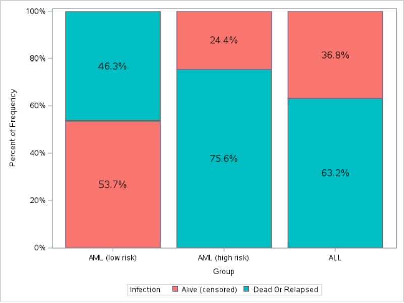
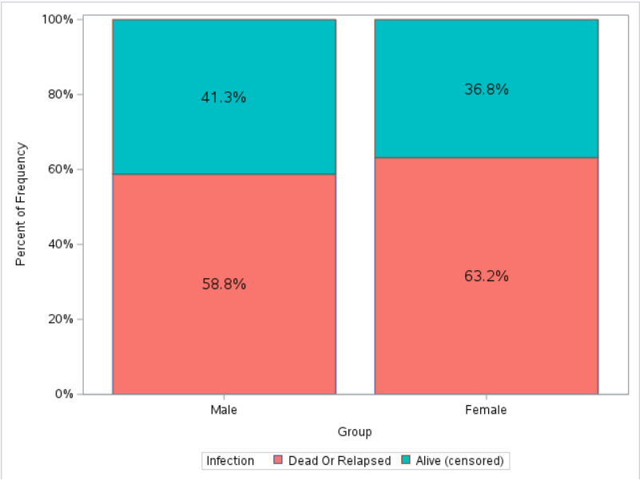
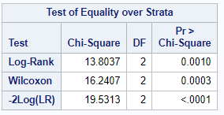
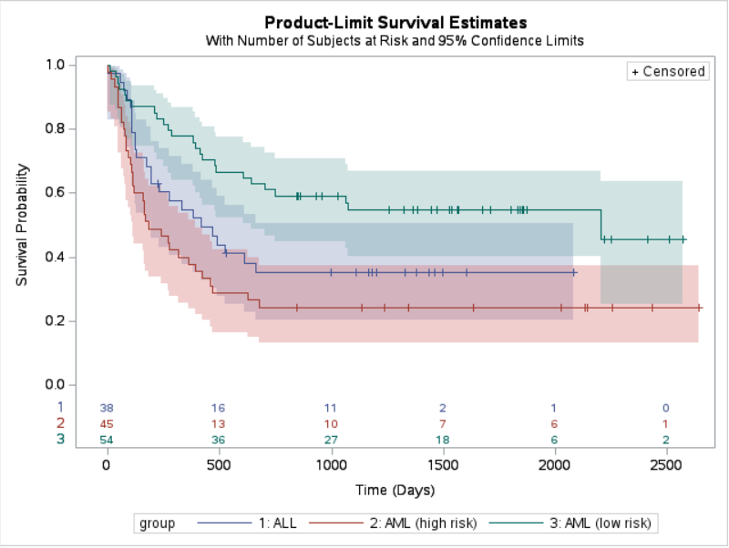
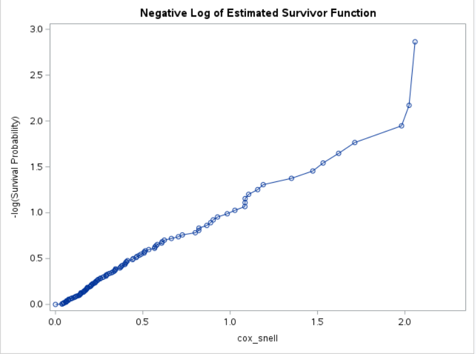
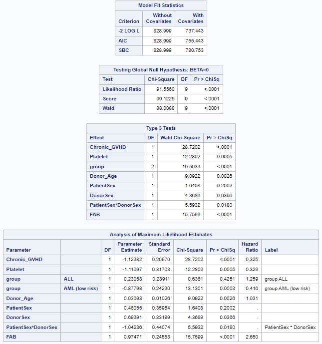
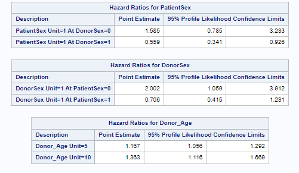
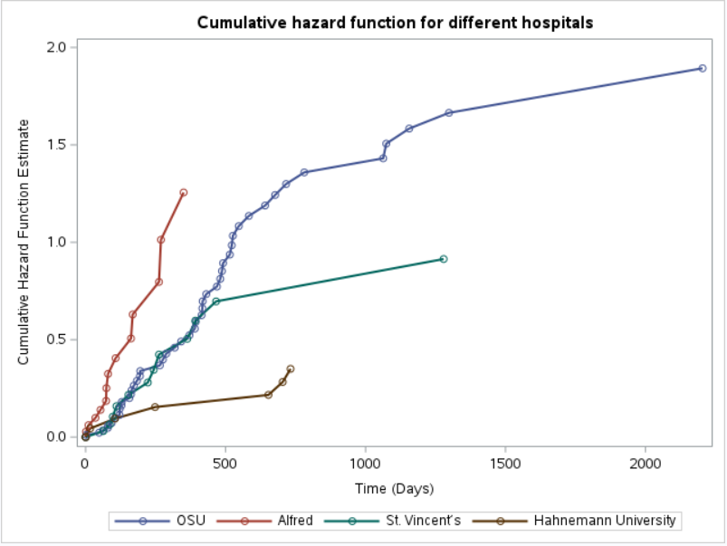
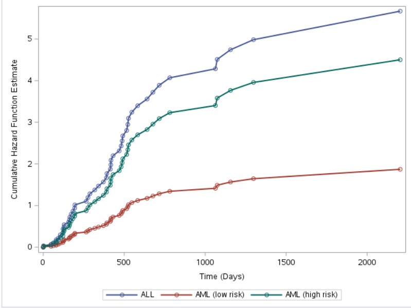

# Analyzing Bone Marrow Transplantation for Leukemia using Cox Proportional Hazard model

Leukemia has been more common in the US population with an estimated 23,000 death in the country. In this project, we focus on individuals who have acute myeloctic leukemia (AML) and acute lymphoblastic leukemia (ALL). To battle cancer individuals were given a bone marrow transplant along with 120 mg/kg of intravenous cyclophosphamide (Cy) and 16 mg/kg of oral Busulfan to aid individuals with leukemia.

Patients were classified into 3 groups: ALL, AML low-risk first remission, and AML high-risk second remission or untreated first relapse.

Interested in time from transplant to death/relapse (competing risk)

## Explanatory analysis

Data contains 137 subjects with 83 patients died or relapse and remaining 54 patients are censored.

The figure below shows the proportional death/relapse for each group. 

In this study there is 57 females and 80 males. The plot below shows the frequency of gender by death/relapse.

### Non-parametric methods

Used non parametric to plot the survival curve of the 3 groups and test for difference between the groups survival curve. 

The table below shows that the average survival time are different between the 3 groups at a significance level of .05. The survival plot is shown below.

Using non-parametric, the Cox Proportional Hazard model is chosen to analyze the risk of different variables specifically the
primary factor of the 3 risk groups. 

Based on the likelihood ratio test, both times to events (death/relapse) can be described by the same estimated parameters.

Backward model selection was used to select important predictors. Check  proportional hazard assumption using Schoenfeld residual. There were no a patterns thus assmptions was satisfied. The Cox Snell residuals were used to determined how well the model fits. Figure shown below, shows relative linear thus the model is a not a bad fit of the data. The deviance residual plot shows that there is no outliers in the data however this is only a reference since the data has more 25% censored subjects.

The table below is the summary of the final model paramters.

The figure below shows hazard ratio and 95% confidence level for some of the variables.

Comparing the AML low risk against the baseline AML high-risk the risk of death/relapse decreased by 58%. In the risk group ALL, the risk of death/relapse is 3 times greater than in the AML low-risk group. There is no statistical difference between ALL and AML high-risk groups. Also, for individuals who develop chronic graft-versus-host disease (GVHD), complications affecting various organs decrease the risk of death/relapse by 67% for those who did not develop chronic GVHD. 

In the model the variables used such as chronic and Acute GVHD are indicators on whether the disease develops or not. However, this might be a limitation of the model since the time the patients develop the disease might also impact the risk of death/relapse. Future studies would add time depending on variables to the Cox PH model.
 
 
 
## Baseline & Prediction

In the final model the hospitals variables as a strata thus we don’t have any information on the estimated coefficient. But we can describe the variable visually. The cumulative hazard for Alfred hospital increases a lot more rapidly than the other hazard as the time in days increases. The Hahnemann University Hospital cumulative hazard increased at the slowest rate. 

The next plot are the predictions using the Cox PH model. The plot below shows the prediction for patient from OSU hospital, male 28 years old, donor is male, develop acute GVHD and platelets returned to normal. The ALL risk group has the highest cumulative hazard risk of to died/relapse compared to the other

